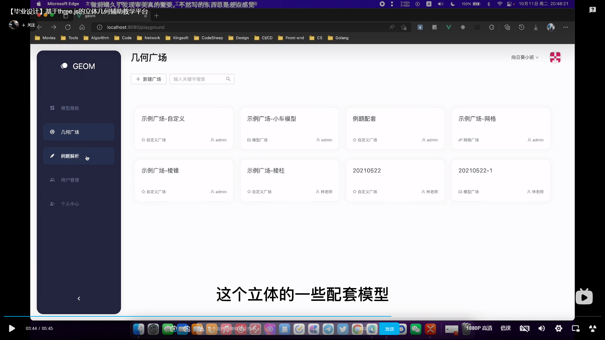

# Computed and Watch

> This section uses single-file component syntax for code examples

# Computed values

Sometimes we need state that depends on other state - in Vue this is handled with component computed properties. To directly create a computed value, we can use the computed function: it takes a getter function and returns an immutable reactive ref object for the returned value from the getter.

```vue
const count = ref(1)
const plusOne = computed(() => count.value + 1)

console.log(plusOne.value) // 2

plusOne.value++ // error
Alternatively, it can take an object with get and set functions to create a writable ref object.

const count = ref(1)
const plusOne = computed({
  get: () => count.value + 1,
  set: val => {
    count.value = val - 1
  }
})

plusOne.value = 1
console.log(count.value) // 0
```

# Computed Debugging `3.2+`

`computed` accepts a second argument with `onTrack` and `onTrigger` options:

* onTrack will be called when a reactive property or ref is tracked as a dependency.
* onTrigger will be called when the watcher callback is triggered by the mutation of a dependency.

Both callbacks will receive a debugger event which contains information on the dependency in question. It is recommended to place a debugger statement in these callbacks to interactively inspect the dependency:

```vue
const plusOne = computed(() => count.value + 1, {
  onTrack(e) {
    // triggered when count.value is tracked as a dependency
    debugger
  },
  onTrigger(e) {
    // triggered when count.value is mutated
    debugger
  }
})

// access plusOne, should trigger onTrack
console.log(plusOne.value)

// mutate count.value, should trigger onTrigger
count.value++
```

onTrack and onTrigger only work in development mode.


